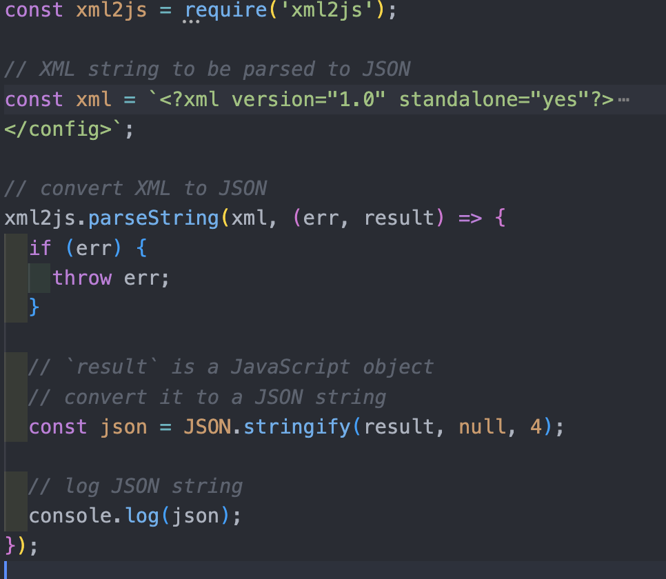
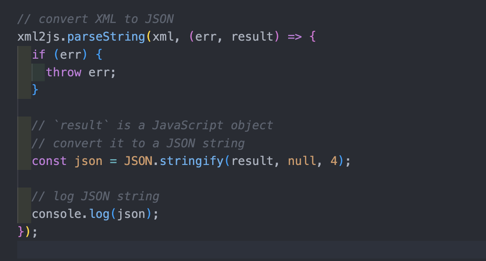

# dooh-challenge-michael-stephanou

## The Brief

- Using whatever means you see fit, use the information in the XML file, and display it using a
  Vue Single Page Application.
- How it looks is up to you. There are no right or wrong answers.

## Project setup

In the terminal enter the following commands:

- To install all the dependencies listed in the package.json: - $ npm install
- Run the app on localhost:8080 - $ npm run serve
- Navigate to http://localhost:8080/

## Timeframe

7 Days

## Technologies installed

- Vue.js (Vue 3)
- Vue Router (v4.0.3)
- JavaScript (ES6)
- Node (v17.9.1)
- NPM (v8.11.0)
- Popper.js (v2.11.6)
- xml2js (v0.4.23)
- JSON Server (v0.17.0)

# Process

## Day 1 - 4

Before building the project, I did some research on the Vue framework, I had never used it before and relished the oppurtunity to learn a new framework and to apply that knowledge in this challenge. From the tutorials I watched, I learned a lot about Vue, from the basics to more nuanced concepts, like the Composition API,nCustom Directives, Conditional Rendering, Lifestyle Hooks, Slots, and Input Bindings.

## Day 5

I started the development process by building my HomePage component, I spent most of the project time working out how to convert the provided XML data into JSON in order to inject the data to the app, this was important to me because I wanted to display that i had an understanding of what the brief had asked of me. I discovered a node package called xml2js that would allow me to acheive this, by writing a script that would parse xml data to JSON i was then able to log the results in the console and from there i created a file to store in the root component of the app, ready to be imported where neeed

## Day 6 - 7

Timeframe: 2 days

After getting the XML data converted, I decided to move onto my frontend, I started by building the HomePage components. By importing the JSON data to the frontend, I was able to inject data to my templates. To acheive this, i used Vue's _v-for_ and _v-bind_ directives to iterate over the data, great features.

## Styling

By the time it came to styling my app, I was up and against the clock somewhat, and decided to go with Bootstrap as it enabled a quick turnaround code-wise and comes responsive out of the box, which is nice.

## Future features

When it came to building the project, i haad so many ideas on how to make it fun and creative. Initially, wanted to make a reaction game where upon finishing, the user would be taken to the main splash page of the app (like an easter egg of sorts). I thought this type of interactivity and engagement with the user reflects strongly with DOOH.COM's previous campaigns and had i more time, i would've tried to implement this.

Another feature i would have loved to make happen would have to do with the 3 png files. I was toying with the idea of having them stacked on top of each other and have them styled with a cross-fade animation, and, depending on the time of day they would transition according to the _takeover_ id they shared in the data file.

## Wins and Key learnings

Working on a challenge with a new framework was an exciting and enjoyable experience, I have previous experience working with React which shares some familiar concepts like state management, so i had a pretty smooth time picking up some pf the core concepts that makes Vue unique. I loved working with this framework and want to dive deeper. The project taught me how to manage a little piece of work at a time, and to refrain from bouncing from one idea to the next. Albeit there were indeed some trade-offs working solo, not having the luxury of debugging with a teammate, or generally asking for a second opinion/advice during the process was something I missed.
